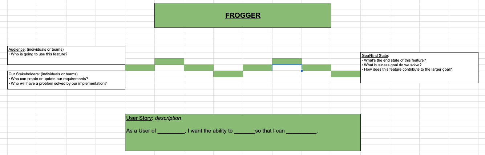

# frogger

An Agile Team Exercise Loosely Based on Exercises Found Within GV's
 [Design Sprints](https://www.gv.com/sprint/).

## Overview

Frogger was originally developed between two friends while exploring sprint
 design exercises in one week PoC to Production "Design Sprints".

The goal of Frogger is to promote diverse thinking in collaboration to create
an aggregate list of tasks required to complete in order to achieve an
overarching objective (typically a feature or set of features).

The outcome of the exercise is a pointed task list that can be executed on by
 any participant of the discussion.

## Step 1: Summarize the Problem Statement

In this initial step, we discuss the high level problem and the surrounding
context. If we don't know exactly what we want to build to solve the problem,
 we use this time to execute other exercises like "Crazy 8's" as a means of
 zeroing in on the problem and our solution

## Step 2: Define the User Story

Here we want to summarize the solution we arrived at in the previous step as a
formal User Story using the `"As a ___, I want to ___, so that I can ___"`
format.

## Step 3: Define our Stakeholders

Here we move to the bottom left of the graph and we ask the following questions:

- Who can create or update our requirements?
- Who will have a problem solved by our implementation?

We're looking to identify who can affect change in our requirements as we
progress through the work. We want to know exactly who we should keep in the
loop and do consistent check-ins with as we complete tasks.

Entries here are typically single individuals or squads and/or teams

## Step 4: Define our Audience

Moving to the top left:

- Who is going to use this feature?

We're looking for who our users are here because we want our implementation
to reflect our users.

Entries here are typically single individuals or squads and/or teams

## Step 5: Summarize what the Stakeholders and Audience will be able to do when this feature/work is completed

Moving to center right:

- What's the end state of this feature?
- What business goal do we solve?
- How does this feature contribute to the larger goal?

We want to identify exactly what our end state is. This doesn't necessarily
have to match with the User Story but it should be exactly what we, as an
engineering team, want to implement.

## Step 6: Timed 3 minute Execution

On your own set of post-it notes (or, if remote, on separate pages of the
excel-like form), write every single step you think it will take to complete
the end state/goal for our Users and Stakeholders. Everyone, technical and
non-technical alike, should participate in this exercise.

We're trying to maximize for diversity in thinking in this step. Encourage
participants to think of everything from infrastructure provisioning, testing,
announcements, deprecation of existing software, in addition to deep technical
steps like creating objects, migrating databases, etc.

## Step 7: Walk-through and Aggregate Individual Responses

One by one, invite each participant to walk through their individual task list.
 Be curious. Ask questions. Flesh out not only the immediate task as described
 but how that tasks related to the overall implementation. Encourage other
 participants to ask questions too. As you find duplicates, discard them. As
 you come up with new items during discussion, add them.

The goal of this step is to create a complete and ordered list of all tasks
required to reach the end state for our Audience and Stakeholders.

## Step 8: Summarize Aggregate Task List

In this quick step, we walk through the entire task list. For each item we do a
cursory check for coherence, completeness, wrap up any additional discussions,
and we end this step by creating a user story using the BDD model

> GIVEN a specific user scenario WHEN an initiation of some action or occurrence
> THEN the system reacts in some fashion

*Note: There can be multiple WHEN statements and for additional GIVEN, WHEN a
use of "AND" is sufficient.

## Step 9: Group Point and Optional: Assignment

In this step, we walk through each task and group point. It's important that
everyone who created tasks also participate (technical and non-technical) in
the pointing process. Fibonacci is recommended.

Feel free to break tasks down further if they exceed your team's planning
limits.

Optionally, you can begin to assign tickets here. Although, for most teams in a
design sprint, flexibility of assignment is of crucial importance, and we
typically keep these tasks unassigned.

## Step 10: Create Tickets from Task Items

Assign one member of team as a Scribe (typically the Host), and move all these
line items into Jira Tickets or Github Issues. It is important that as they're
added to the ticketing system, that the summary of the ticket contains a User
Story summarizing the task. The Scribe/Host should spend an adequate amount of
time detailing these User Stories and any nuances found during previous
discussion.

## Exercise Intangibles

- By far the most important aspect of Frogger is the host's ability to
  question and clarify. It is incumbent for the host to actively participate in
  the discussion; to go beyond a cursory understanding and understand the task
  lists as if he or she were implementing it by themselves
- Frogger works well to clarify abstract problems, however when doing so,
  more time is required up front to develop the user story, audience,
  stakeholders, and end goal
- Check-ins with stakeholders as well as User Testing is highly encouraged.
  In a typical Design Sprint week, we would use Monday

## Where did the name "Frogger" come from?

The name "Frogger" comes from the post-it notes that resemble "lily pads"
that are placed between the audience/stakeholders and the end/completion goal

## Support

💎  J.Stone
